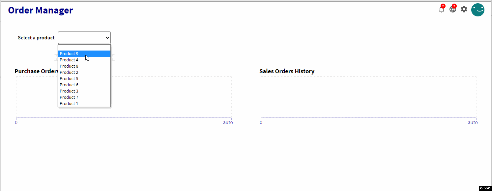

# Order Manager a REST API and REACT App
This app has the following components:

- A REACT UI App. An REACT App which show in two charts both purchase and sales orders.
- A REST API. An Express app which exposes all endpoints required to process the request orders
- A Postgres database to persist all orders.

The APP process two order types:
## Purchase Orders
This contains the following info:

- id: Order identifier
- issueDate: Purchase order date
- quantity: Quantity of product units
- productId: Product identifier
- productName: Product name

The purchase orders are send through the following endpoint

```
POST /api/v1/purchase_order

{
  "id":"1234",
  "issueDate":"2021-09-01",
  "quantity":10,
  "productId":"123",
  "productName":"Test"
}
```

## Sales Orders
The sales orders contains the following info:

- id: Order identifier
- issueDate: Sales order date
- quantity: Quantity of product units
- productId: Product identifier
- productName: Product name

The sales orders are send through the following endpoint:

```
POST /api/v1/sales_order

{
  "id":"1234",
  "issueDate":"2021-09-01",
  "quantity":10,
  "productId":"123",
  "productName":"Test"
}
```

In order to process and Sales Order it should take in account the following rules:

- There is a monthly thresold by product to process a sales order, it is 30 units.
- There must be stock as requirement to process a sales order.
- An FIFO approach is required to process a sales order and discount from the stock.


# The Solution
## How to run the app
The entire application can be run with a single terminal command:

```
docker-compose up -d
```

The REST API is listening on PORT 4000
The UI is running on PORT 1337

The REST API documentation is available on:

```
http://localhost:4000/api-docs/
```

The following **containers**, **volume** and **network** will be created after execute the above command.

Containers:
- **db**: It is a postgres database. The _.env_ file contains the configuration required to configure the database
- **backend**: It is a Rest API which use Express.  
- **frontend**: It is a REAT App which show in two charts the differents orders filtered by products. 

Volumes:
- **dbdata**
- **node_modules**

Network
- **app-network**

If you want to stop it, run the following command:

```
docker-compose down
```

## Endpoints
There are 5 endpoints:

- POST http://localhost:4000/api/v1/purchase_order
- POST http://localhost:4000/api/v1/sales_order
- GET http://localhost:4000/api/v1/products
- GET http://localhost:4000/api/v1/purchase_orders/product/:id
- GET http://localhost:4000/api/v1/sales_orders/product/:id

More details in the specification URL:

```
http://localhost:4000/api-docs/
```